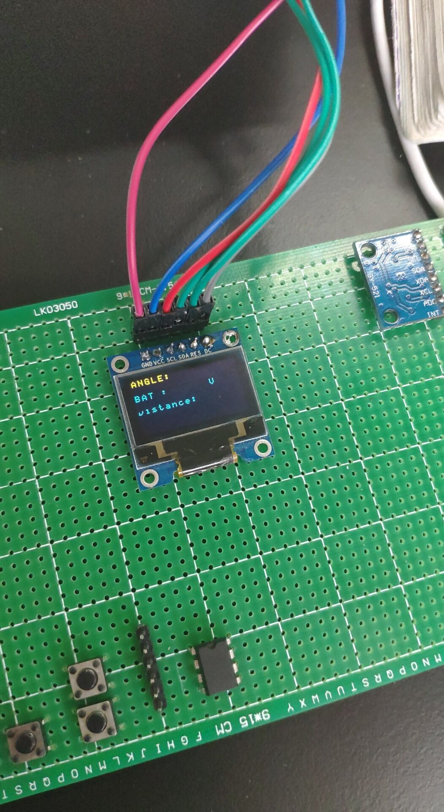

# DSP283335Demo_OLED
## 该例程是基于DSP28335芯片移植的IIC和SPI工程，主要用来驱动0.96寸的OLED显示屏。

* APP文件夹下三个文件：IICOLED，SPIOLED，LED，public,MPU6050
* IICOLED和SPIOLED是独立，所以如果你选择用IIC协议的OLED就不能加载SPIOLED的显示屏了，同理SPIOLED用了就不能加载IIC了
* LED和public是一些简单的文件
* IIC用的是(模拟)GPIOA14/15
* SPIO用的是(模拟)GPIOA14/15/16/17
* MPU6050主要是（模拟)GPIOA10/11/12

效果图：
# IIC

# SPI

# MPU6050
